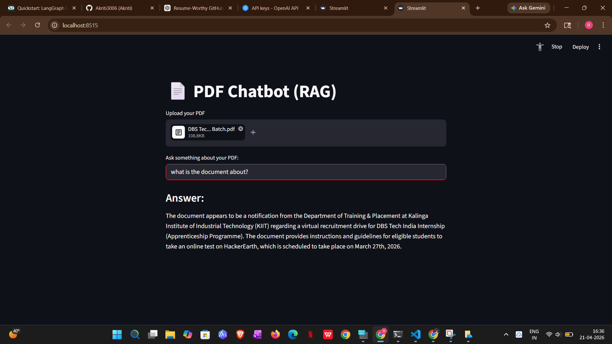

# 📄 AI PDF Chatbot (RAG)

An AI-powered chatbot that allows users to upload PDF documents and ask questions about their content using **Retrieval-Augmented Generation (RAG)**.

Built with a modern AI stack, this project combines semantic search and large language models to deliver accurate, context-aware answers from documents.

---

## 🚀 Demo



---

## ✨ Features

* 📂 Upload and process any PDF document
* 🔍 Semantic search using FAISS vector store
* 🤖 Context-aware answers using LLM (LLaMA 3 via Groq)
* ⚡ Fast inference with Groq API
* 🧠 HuggingFace embeddings for high-quality retrieval
* 💻 Interactive UI using Streamlit

---

## 🛠 Tech Stack

* **Python**
* **Streamlit**
* **LangChain**
* **FAISS (Vector Database)**
* **Groq API (LLaMA 3)**
* **HuggingFace Embeddings**

---

## 📁 Project Structure

```
rag-pdf-chatbot/
│── app.py              # Main Streamlit app
│── requirements.txt   # Dependencies
│── README.md          # Project documentation
│── DEMO.png           # Screenshot
│── .gitignore
```

---

## ⚙️ Setup Instructions

### 1. Clone the repository

```bash
git clone https://github.com/your-username/rag-pdf-chatbot.git
cd rag-pdf-chatbot
```

---

### 2. Create virtual environment (recommended)

```bash
python -m venv venv
venv\Scripts\activate     # On Windows
```

---

### 3. Install dependencies

```bash
pip install -r requirements.txt
```

---

### 4. Add environment variables

Create a `.env` file in the root directory:

```
GROQ_API_KEY=your_api_key_here
```

---

### 5. Run the application

```bash
streamlit run app.py
```

---

## 🧠 How It Works

1. PDF is uploaded and text is extracted
2. Text is split into chunks
3. Chunks are converted into embeddings
4. Stored in FAISS vector database
5. User query → similarity search
6. Relevant context sent to LLM
7. LLM generates accurate answer

---

## 📌 Example Use Cases

* 📚 Study notes & textbooks
* 📄 Research papers
* 📑 Legal/official documents
* 🧾 Reports & PDFs

---

## 🚀 Future Improvements

* Chat history support
* Multiple PDF upload
* Source citations in answers
* Deployment (Streamlit Cloud)
* Better UI/UX

---

## 👩‍💻 Author

**Akriti Rai**

---

## ⭐ If you like this project

Give it a star on GitHub ⭐ and feel free to contribute!
